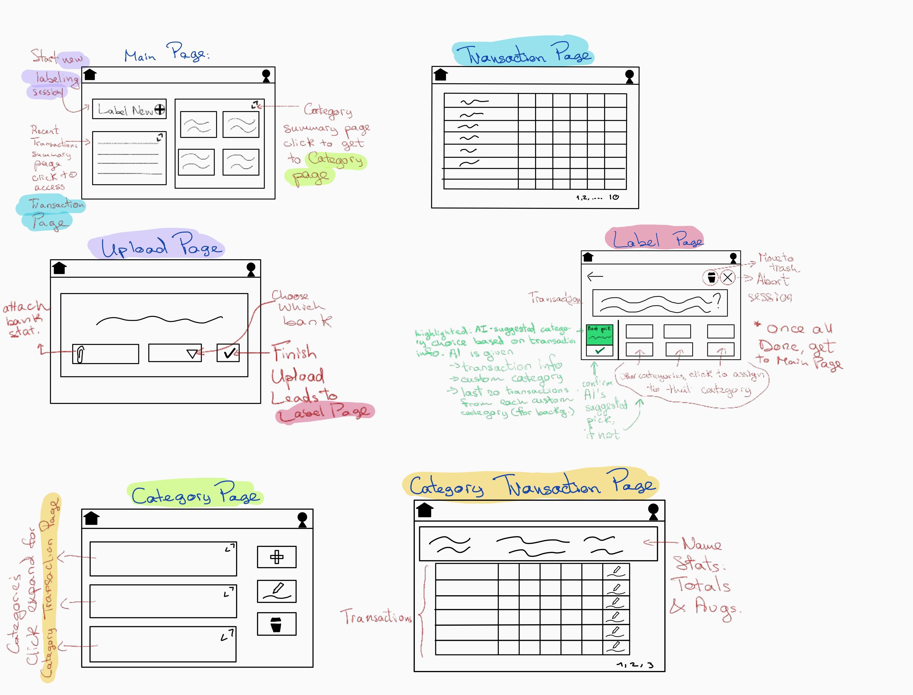
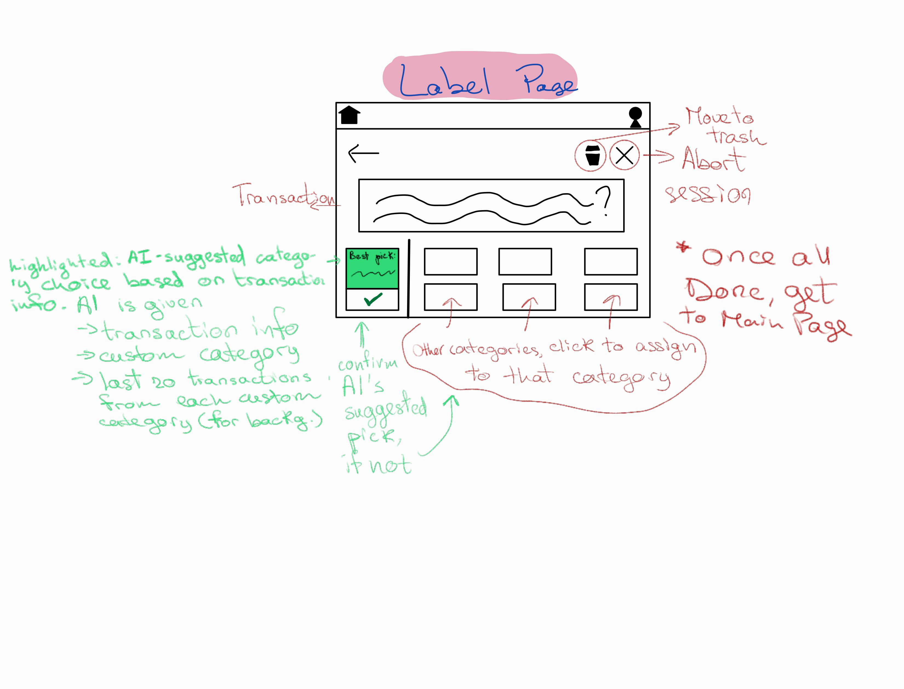

# Table of Contents
- [Clear Distinction Testcases](test/label-clear.ts)
    - <code>npm run clear</code> for this test only
- [Subtle Distinction Testcases](test/label-subtle.ts)
    - <code>npm run subtle</code> for this test only
- [Many Categories Testcases](test/label-many-cats.ts)
    - <code>npm run many</code> for this test only
- [Realistic Description Testcases](test/label-realistic.ts)
    - <code> npm run realistic</code> for this test only
- [Versions of the prompts](prompt_engineering.md)
  - Experiments & Variants
  - Validations
- [Specification of the AI augmented concept](label.spec)
- [README](README.md)
  - AI augmented concept in markdown
  - AI augmentation sketch
  - AI augmentation User journey
  - Entire Concept (pre-AI from previous hw)


# Concept
**concept:** Label  

**purpose:** record the user's assignment of a specific transaction to a specific category so that spending meaning is explicit and auditable  

**principle:** a label ties exactly one transaction to exactly one category for its owner.\  
AI suggests a most likely category to reduce cognitive effort, but the final decision always belongs to the user.\
Creating or changing a label never alters the transaction's imported data and preserves a traceable history of who assigned what and when.  

---

**state:**  
> a set of **Labels** with  
>> a `tx_id` : ID  
>> a `category_id` : ID  
>> a `user_id` : ID  
>> a `created_at` : Timestamp  
>
> a set of **TransactionInfo** with  
>> a `tx_id` : ID  
>> a `tx_name` : String  
>> a `tx_merchant` : String  
>
> a set of **CategoryHistory** with  
>> a `category_id` : ID  
>> a set of transactions : TransactionInfos  

---

**actions:**  

> **apply**(user_id : ID, tx_id : ID, tx_name : String, tx_merchant : String, category_id : ID) : (label : Label)  
>> *requires:*  
transaction exists and `transaction.owner_id = user_id`;  
category exists and `category.owner_id = user_id`;  
no existing label for `tx_id` in Labels  
>> *effects:*  
creates a TransactionInfo with associated id, name, and merchant;  
adds TransactionInfo to the CategoryHistory;  
creates a label associating `tx_id` to `category_id` with `user_id` and current timestamp; adds it; returns the label  

---

> **update**(user_id : ID, tx_id : ID, new_category_id : ID) : (label : Label)  
>> *requires:*  
a label for `tx_id` exists; `transaction.owner_id = user_id`;  
`new_category_id` exists and `owner_id = user_id`;  
TransactionInfo exists with `transactionInfo.id = tx_id`  
>> *effects:*  
updates CategoryHistory, associating TransactionInfo with the new category;  
replaces the label’s `category_id` with `new_category_id`;  
updates `created_at` to now; returns updated label  

---

> **remove**(user_id : ID, tx_id : ID)  
>> *requires:*  
a label for `tx_id` exists; `transaction.owner_id = user_id`  
>> *effects:*  
reassigns the transaction’s label to the user’s built-in **Trash** category;  
updates CategoryHistory, associating the transaction with the trash category  

---

> **suggest**(llm : GeminiLLM, user_id : ID, allCategories : [(ID, String)], transactionInfo) : (suggested_category_id : ID)  
>> *requires:*  
user has ≥ 1 category  
>> *effects:*  
returns a best-guess category_id from the user’s existing categories for this `tx_id`, highlighted in the UI;  
suggested by AI and does **not** alter Labels state  

---

**invariants:**  
- at most one label per tx_id  
- `label.user_id = transaction.owner_id` for the labeled transaction  
- a label’s category.owner_id = label.user_id  
- suggestions do not create or modify labels until the user explicitly applies or updates  

---

**notes:**  
> CategoryHistory is a record used for AI suggestions and later UX. Labels remain the source of truth for what’s currently assigned.  \
> TransactionInfo carries merchant and name fields since the AI needs them for interpreting.  \
> TransactionInfo must be passed into `suggest` because suggestions apply to transactions not yet labeled—there’s no existing connection from transaction id -> transaction info within the Label concept.  


**AI-augmented sync**
**sync:** suggestCategoryForTransaction  
**when** Request.viewTransaction(user_id: ID, tx_id: ID)  
**where** Transaction.owner(tx_id) = user_id  
**then** Label.suggest(user_id: ID, tx_id: ID): (suggested_category_id: ID)  


### UI sketches

**Full Overview & Interaction**


**Zoomed-in AI augmented page**


### User Journey (AI interaction)

When Alex opens FlashFinance to label his recent transactions, the AI assistant begins helping in the background. As each purchase appears, the system uses the merchant name and description to suggest the most likely category from Alex’s own list. When "Blue Bottle Coffee" comes up, for instance, FlashFinance highlights "Coffee Shops" as the suggested choice. Alex can simply tap to confirm or change to other displayed categories it if needed. The AI never labels anything on its own; it just streamlines the process so decisions feel quick and informed. By the end, Alex has breezed through 40 transactions and feels satisfied that he’s keeping up with his spending habits in a faster, easier way, gaining clarity and confidence in where his money is going. 

---

# Previous Concept (no AI elements)
**concept:** User

**purpose:**  
establish a unique identity for each person and control access to app functionality so that data is isolated per account

**principle:**  
every action in the app executes in the context of a specific, authenticated user; identity is stable (via user_id) and ownership/authorization checks rely only on that identity, not on knowledge of other concepts

**state:**
> a set of Users with  
>> a user_id ID  
>> an email Email  
>> a name String  
>> a password_hash String  
>> a status {ACTIVE | INACTIVE}

**actions:**
> register(email: Email, name: String, password: String): (user: User)  
>> *requires:*  
email is not used by any existing user  
>> *effects:*  
creates a new user with a fresh user_id, password_hash derived from password, status ACTIVE; adds the user to Users; returns the created user

> authenticate(email: Email, password: String): (user: User)  
>> *requires:*  
there exists a user with the given email whose password_hash matches password and whose status is ACTIVE  
>> *effects:*  
returns that user

> deactivate(user_id: ID)  
>> *requires:*  
a user with user_id exists  
>> *effects:*  
sets the user's status to INACTIVE

> changePassword(user_id: ID, old_password: String, new_password: String): (ok: Boolean)  
>> *requires:*  
a user with user_id exists and old_password matches the stored password_hash  
>> *effects:*  
updates password_hash with new_password; returns true

**invariants:**
- email uniquely identifies a single user  
- user_id is unique and never reused  

---

**concept:** Transaction

**purpose:** represent each imported bank record that a user will label

**principle:** transactions are immutable financial records owned by a user; transactions start UNLABELED and gain meaning when linked to a category via a label

**state:**
> a set of Transactions with  
>> a tx_id ID  
>> an owner_id ID    
>> a date Date  
>> a merchant_text String  
>> an amount Money  
>> a status {UNLABELED | LABELED}

**actions:**
> importTransactions(owner_id: ID, rows: [CSVRows]): (txs: [Transactions])  
>> *requires:* owner exists; rows are well-formed; all amounts are positive  
>> *effects:* parses rows into Transactions owned by owner_id with status UNLABELED; generates new tx_ids for each transaaction; adds them to state; returns the created list  

> mark_labeled(tx_id: ID, requester_id: ID)  
>> *requires:*  
transaction tx_id exists; requester_id = transaction.owner_id  
>> *effects:*  
sets transaction.status to LABELED

**invariants:**
- each transaction has exactly one owner_id
- transaction.amount is positive
- status is {UNLABELED, LABELED}
- transactions are created only by parsing a bank statement
- after a transaction first becomes LABELED, it never returns to UNLABELED
- after import, transactions remain immutable records that can be labeled but not directly edited.

---

**concept:** Category

**purpose:** allow users to define and manage meaningful groupings of their transactions

**principle:** categories are user-defined and reusable; each user maintains an independent set referenced by labels

**state:**
> a set of Categories with  
>> a category_name String
>> a category_id ID  
>> an owner_id ID 
>> a name String  

**actions:**
> create(owner_id: ID, name: String): (category: Category)  
>> *requires:*  
user owner_id exists; for the same owner_id, no existing category with same name  
>> *effects:*  
generated a new category_id; creates and stores a category under owner_id associated with name; returns it

> rename(owner_id: ID, category: Category, new_name: String): (category: Category)  
>> *requires:*  
category exists and category.owner_id = owner_id; for the same owner_id, no existing category with same new_name  
>> *effects:*  
updates category.name to new_name; returns updated category

> delete(owner_id: ID, category: Category): (ok: Boolean)  
>> *requires:*  
category exists and category.owner_id = owner_id  
>> *effects:*  
if no current-period label references this category, removes it and returns true; otherwise leaves state unchanged and returns false

**invariants:**
- (owner_id, name) is unique among Categories
- category_id is unique for the same user
- categories cannot belong to multiple users

---

**concept:** Label

**purpose:** record the user's assignment of a specific transaction to a specific category so that spending meaning is explicit and auditable

**principle:** a label ties exactly one transaction to exactly one category for its owner; creating or changing a label never alters the transaction's imported data and preserves a traceable history of who assigned what and when

**state:**
> a set of Labels with  
>> a tx_id ID  
>> a category_id ID  
>> an user_id ID  
>> a created_at Timestamp

**actions:**
> apply(user_id: ID, tx_id: ID, category_id: ID): (label: Label)  
>> *requires:*  
transaction exists and transaction.owner_id = user_id;  
category exists and category.owner_id = user_id;  
no existing label for tx_id in Labels  
>> *effects:*  
creates a label associating tx_id to category_id with user_id and current timestamp; adds it; returns the label

> update(user_id: ID, tx_id: ID, new_category_id: ID): (label: Label)  
>> *requires:*  
a label for tx_id exists; transaction.owner_id = user_id;  
new_category_id exists and has owner_id = user_id  
>> *effects:*  
replaces the label's category_id with new_category_id; updates created_at to now; returns updated label

> remove(user_id: ID, tx_id: ID): (ok: Boolean)  
>> *requires:*  
a label for tx_id exists; transaction.owner_id = user_id  
>> *effects:*  
reassigns the transaction's label to the user's built-in Trash category_id; transaction remains LABELED; returns true

**invariants:**
- at most one label per tx_id
- label.user_id = transaction.owner_id for the labeled transaction
- a label's category.owner_id = label.user_id


---

**concept:** FeedbackMetric

**purpose:** provide per-user, per-category aggregates of labeled transactions so spending activity can be summarized and compared across time periods

**principle:** a feedback metric is a derived summary; it reflects but never alters the underlying transactions, and its role is to provide insight through aggregation


**state:**
> a set of FeedbackMetrics with  
>> an owner_id ID  
>> a category_id ID  
>> a period Period  
>> a current_total Money  

**actions:**
> recompute_for_period(owner_id: ID, category_id: ID, period: Period): (metric: FeedbackMetric)  
>> *requires:*  
owner exists; category exists with Category(category_id).owner_id = owner_id  
>> *effects:*  
creates or updates the FeedbackMetric identified by (owner_id, category_id, period), setting current_total to the sum of amounts of labeled transactions; returns it  

**invariants:**
- (owner_id, category_id, period) uniquely identifies a FeedbackMetric  
- current_total is nonnegative  
- FeedbackMetric.owner_id = Category.owner_id  

### User Journey

Alex, a graduate student frustrated by confusing bank statements and ineffective budgeting tools, turns to FlashFinance to get clarity on his monthly spending.

After signing up and creating an account, Alex sets up a few personal categories such as Groceries, Coffee Shops, and Takeout. He uploads his latest bank statement through the secure uploader, and the app immediately generates an interactive labeling session. Transactions appear one at a time in a clean quick-pick interface, and Alex simply taps to assign each purchase to a category. Once the session is done, he notices that he accidentally labeled a coffee shop expense as groceries, he quickly corrects it with the relabel option.

Now, FlashFinance shows a simple spending summary. The totals make it clear that "Takeout" is consuming far more of his budget than he expected, while "Groceries" are steady and reasonable. 

By the end of the session, Alex feels more in control. He can see exactly where his money went, and the process felt quick rather than tedious. Instead of abandoning tracking after a week, Alex decides to upload his statements regularly, since the workflow makes reflection on spending habits both manageable and engaging.

---

# Instructions
## Prerequisites

- **Node.js** (version 14 or higher)
- **TypeScript** (will be installed automatically)
- **Google Gemini API Key** (free at [Google AI Studio](https://makersuite.google.com/app/apikey))

## Quick Setup

### 0. Clone the repo locally and navigate to it
```cd intro-gemini-schedule```

### 1. Install Dependencies

```bash
npm install
```

### 2. Add Your API Key

**Why use a template?** The `config.json` file contains your private API key and should never be committed to version control. The template approach lets you:
- Keep the template file in git (safe to share)
- Create your own `config.json` locally (keeps your API key private)
- Easily set up the project on any machine

**Step 1:** Copy the template file:
```bash
cp config.json.template config.json
```

**Step 2:** Edit `config.json` and add your API key:
```json
{
  "apiKey": "YOUR_GEMINI_API_KEY_HERE"
}
```

**To get your API key:**
1. Go to [Google AI Studio](https://makersuite.google.com/app/apikey)
2. Sign in with your Google account
3. Click "Create API Key"
4. Copy the key and paste it into `config.json` (replacing `YOUR_GEMINI_API_KEY_HERE`)

### 3. Run the Application

**Run all test cases:**
```bash
npm start
```

### Build Issues
- Use `npm run build` to compile TypeScript
- Check that all dependencies are installed with `npm install`

## Resources

- [Google Generative AI Documentation](https://ai.google.dev/docs)
- [TypeScript Documentation](https://www.typescriptlang.org/docs/)
